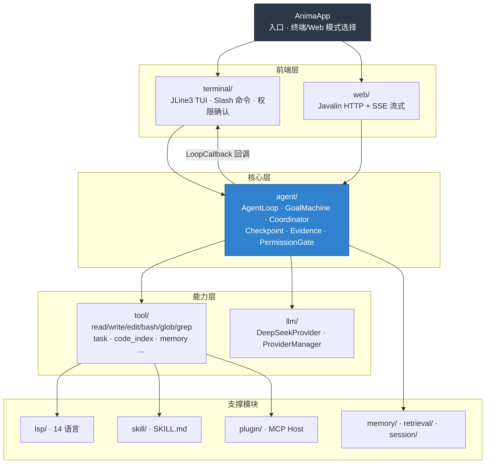
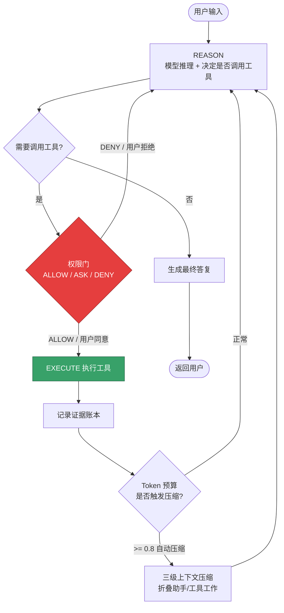

<div align="center">

# Anima

**Java 21 实现的 DeepSeek 原生终端 AI 编码智能体**

_A DeepSeek-native terminal AI coding agent, built on Java 21 + LangChain4j._

对标 [Claude Code](https://www.anthropic.com/claude-code) 与 [Reasonix](https://github.com/esengine/DeepSeek-Reasonix)（Go），在 JVM 生态下实现同级别的自主编码能力。


</div>

---

## 一句话介绍

**Anima 是一个完全自研 Agent Loop 的终端 AI 编码智能体**：它能读写代码、执行命令、跨 14 种语言做符号跳转与诊断、按证据签收任务、在长会话中自动压缩上下文，并通过三态权限体系保证操作安全。核心不依赖 LangChain4j 的 `AiServices` —— 循环、压缩、权限、缓存策略全部手写，只借用其 Provider 层做 API 调用。

> 双模式运行：**终端模式**（默认，`anima`）或 **Web 模式**（`--web` → http://localhost:8080）。

---

## 核心亮点

| 能力 | 说明 | 工程价值 |
| --- | --- | --- |
| **自研 Agent Loop** | `REASON → TOOL_CALL → EXECUTE → 循环`，基于 **Token 预算熔断**而非固定轮次 | 模型自主决定何时停止，避免僵化的轮次上限 |
| **Cache-first 前缀稳定** | System Prompt 前缀（角色 + 项目记忆 + 工具声明）在同一会话中**字节级稳定**，持续命中 DeepSeek 自动前缀缓存 | 显著降低长会话单轮 Token 成本 |
| **三级上下文压缩** | 0.5 软警告 / 0.8 自动压缩 / 0.9 强制；用户消息与错误永不折叠，`tool_call` 与 `tool_result` 严格成对处理 | 长会话可稳定跑更多轮次而不撑爆上下文 |
| **三态权限体系** | `ALLOW / ASK / DENY` + glob 规则 + 会话授权记忆；Plan Mode 是先于权限层的只读闸门 | 破坏性操作可控，交互式确认 |
| **14 种语言 LSP 集成** | JSON-RPC 帧协议 + 多语言进程池 + 懒启动；`definition / references / hover / diagnostics`，不可用时自动降级到 `code_index` | Reasonix 无此能力，Anima 独有增强 |
| **Skills + MCP 生态** | `SKILL.md` 标准（Inline + Subagent 双模式）；`.mcp.json` 插件系统（stdio JSON-RPC + HTTP/SSE） | 能力可插拔、可扩展 |
| **Checkpoint / Rewind** | 快照式文件回退，`/rewind` 命令一键回到任意检查点 | 误操作可恢复 |
| **GoalMachine + Coordinator** | 长时间自主任务状态机 + 双模型 Planner(Pro) / Executor(Flash) 分离 | 规划与执行会话隔离，各自缓存稳定 |
| **证据驱动签收** | per-turn 工具调用证据账本，`complete_step` 基于证据签收，与 `todo_write` 形成闭环 | 防止"假装完成"，可验证 |

---

## 系统架构

分层依赖严格无环：`AnimaApp → terminal / agent → tool / llm`。



**依赖约束**（保证无环）：

- `agent/` **不依赖** `terminal/` —— AgentLoop 通过 `LoopCallback` 接口回调 UI，因此终端 TUI、Web SSE、子 Agent 共用同一个循环。
- `tool/` **不依赖** `agent/` —— 工具不知道 Agent 的存在。
- `llm/` **不依赖**任何业务包 —— 纯 LLM 调用层。

---

## Agent 循环流程



会话运行中，用户可用 `!<消息>` 做 **mid-turn steer** 注入指导，走独立通道而不破坏前缀缓存；连续相同失败会触发 **Storm Breaker** 自动切换策略，重复写入会被 **Repeat Guard** 拦截。

---

## 快速开始

### 前置条件

- JDK 21+
- Maven 3.8+
- DeepSeek API Key（[申请地址](https://platform.deepseek.com/api_keys)）

### 构建

```bash
mvn package
```

### 运行

```bash
# 终端模式（默认）
mvn exec:java -Dexec.mainClass="com.anima.AnimaApp" -Dexec.args="--terminal"
# 或使用打包后的启动脚本
anima            # Windows: anima.bat

# Web 模式 → http://localhost:8080
mvn exec:java -Dexec.mainClass="com.anima.AnimaApp" -Dexec.args="--web"
```

### 配置 API Key

三种方式任选其一（优先级从高到低）：

```bash
# 1) 环境变量
set DEEPSEEK_API_KEY=sk-xxxx          # Windows
export DEEPSEEK_API_KEY=sk-xxxx       # Linux/macOS

# 2) 启动参数
mvn exec:java ... -Danima.api.key=sk-xxxx

# 3) 首次运行时交互式输入，自动保存到 ~/.anima/config.properties
```

> MCP 插件配置：复制 `.mcp.json.example` 为 `.mcp.json`，填入你自己的密钥（该文件已被 `.gitignore` 排除，不会入库）。

### 常用终端命令

| 命令 | 作用 |
| --- | --- |
| `/help` | 列出所有命令 |
| `/model` | 运行时热切换模型 |
| `/plan` | 进入只读规划模式 |
| `/init` | 分析项目并生成 `ANIMA.md` |
| `/memory` | 查看项目记忆 |
| `/rewind` | 回退到某个检查点 |
| `/goal` | 启动长时间自主任务 |
| `/sessions` | 管理已保存会话 |
| `/compact` | 手动压缩上下文 |

---

## 项目结构

```
src/main/java/com/anima/
├── AnimaApp.java          # 入口：终端/Web 模式选择、首次运行引导
├── agent/                 # 核心：AgentLoop、GoalMachine、Coordinator、Checkpoint、权限、证据
├── tool/                  # 内置工具：读写/编辑/bash/glob/grep/task/code_index/memory...
├── llm/                   # LLM 层：DeepSeekProvider、ProviderManager（多模型热切换）
├── lsp/                   # LSP 集成：JSON-RPC、多语言进程池、4 个 LSP 工具
├── skill/                 # Skills 系统：SKILL.md 标准、Inline + Subagent
├── plugin/                # MCP 插件宿主：stdio JSON-RPC + HTTP/SSE
├── memory/                # 分层项目记忆：ANIMA.md / @import / 祖先链发现
├── retrieval/             # BM25 索引（跨会话历史检索）
├── session/               # 会话持久化（JSONL 保存/恢复）
├── terminal/              # JLine3 TUI、Slash 命令、权限确认
├── config/                # 配置加载、多模型注册
├── hook/                  # 生命周期钩子（Pre/PostToolUse 等）
└── web/                   # Javalin HTTP + SSE 流式端点
```

---

## 版本演进

| 版本 | 主题 | 关键能力 |
| --- | --- | --- |
| v0.9 | 基础可用 | Agent 循环、三级压缩、三态权限、12 个内置工具、流式 LLM、终端 UI |
| v0.10 | Loop Engineering | Evidence 证据系统、`complete_step`、Plan Mode、Grace Round |
| v0.11 | 会话持久化 | JSONL Session、Slash 命令系统、孤儿 tool_call 修复 |
| v0.12 | 多模型 + 代码索引 | LLMProvider 抽象、`/model` 热切换、`code_index`（14 语言） |
| v0.13 | LSP 集成 | JSON-RPC 传输、多语言进程池、4 个 LSP 工具（**独有**） |
| v0.14 | 工程级健壮性 | Subagents、Hooks、Mid-turn Steer、Storm Breaker、Repeat Guard |
| v0.15 | Skills + MCP | SKILL.md 系统、MCP 插件、Ask/Remember/Forget、Output Style |
| v0.16 | 能力对齐 | Checkpoint/Rewind、GoalMachine、Coordinator、ParallelTasks、BM25 |
| **v0.17** | **记忆升级（当前）** | memory 搜索、跨项目全局记忆、Archive 归档、祖先链发现、3 个新工具 |

完整路线图见 [ANIMA_ROADMAP.md](./ANIMA_ROADMAP.md)。

---

## 技术栈

- **语言/运行时**：Java 21（record、switch 表达式、文本块）
- **LLM**：DeepSeek V4（Flash / Pro 双模型），LangChain4j 1.16 Provider 层
- **Web**：Javalin 6（HTTP + SSE）
- **终端**：JLine 3（REPL、交互式权限确认）
- **序列化**：Jackson 2.18
- **构建**：Maven + Shade（可执行 fat-jar）

---

## 对标与定位

Anima 以 **Reasonix（Go 实现）** 为演进参照，目标是在 Java 生态下实现同等的 Claude 级终端智能体能力边界：

- **当前对齐度约 70%**：核心 Agent 循环、压缩、权限、SubAgent、Checkpoint、Goal、Coordinator、Skills、MCP 均已对齐。
- **独有增强**：14 种语言 **LSP 集成**（Reasonix 无此能力）。

---

## License

[MIT](./LICENSE)
